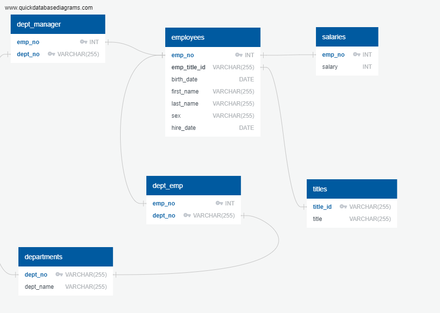
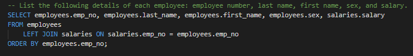
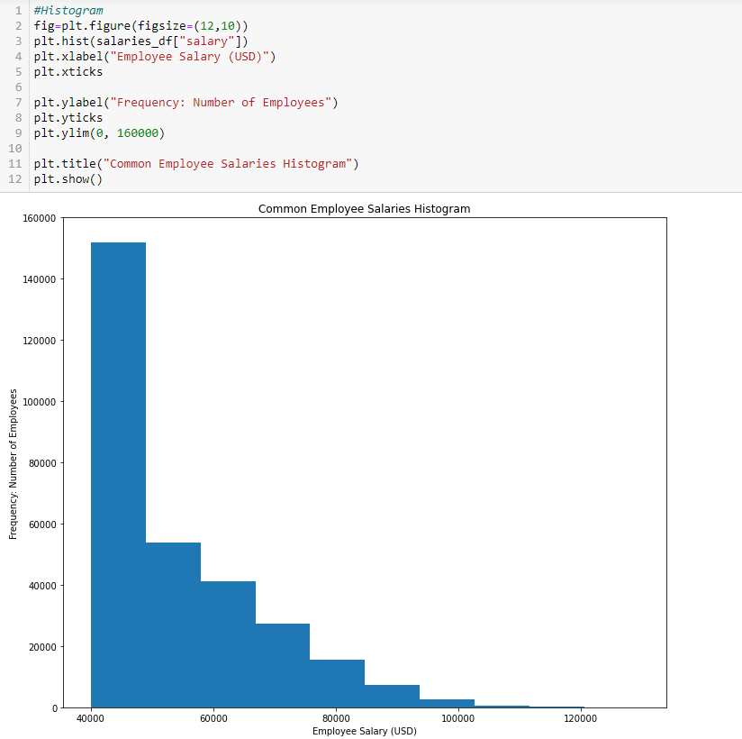
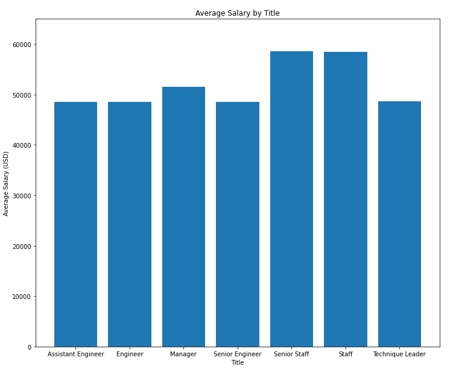
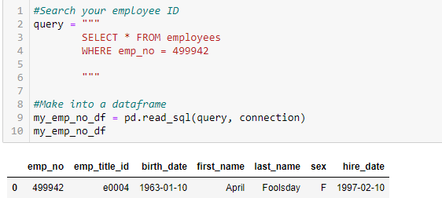

# SQL: Employee Database

## Background

It is a beautiful spring day, and it is two weeks since you have been hired as a new data engineer at Pewlett Hackard. Your first major task is a research project on employees of the corporation from the 1980s and 1990s. All that remain of the database of employees from that period are six CSV files.

This assignment utilises: 
 * ERD skills through QuickDatabaseDiagrams
 * CSV file importing to SQL platform PgAdmin4 with Postgress
    * CSV files found in DATA folder
    * schema to create tables found in schema.sql
 * Querying the CSV data in PgAdmin4 to get sepcific results
    * query listed in query.sql along with corresponding code
 * Juypter notebook for testing if data provided was ficticious material 
    * Using sqlalchemy, matplotlib, pandas and numpy

## ERD used to connect tables

## Sample of Queries in PgAdmin4

## Histogram of Salary Range for company

## Bar Graph of Average salary by Title

## Outcome
Upon reviewing the data, the data is found to be false. 
 
In so much that it was fabricated by the company as a test and not actual company records.
 
The employee id we were given returned April Foolsday.

